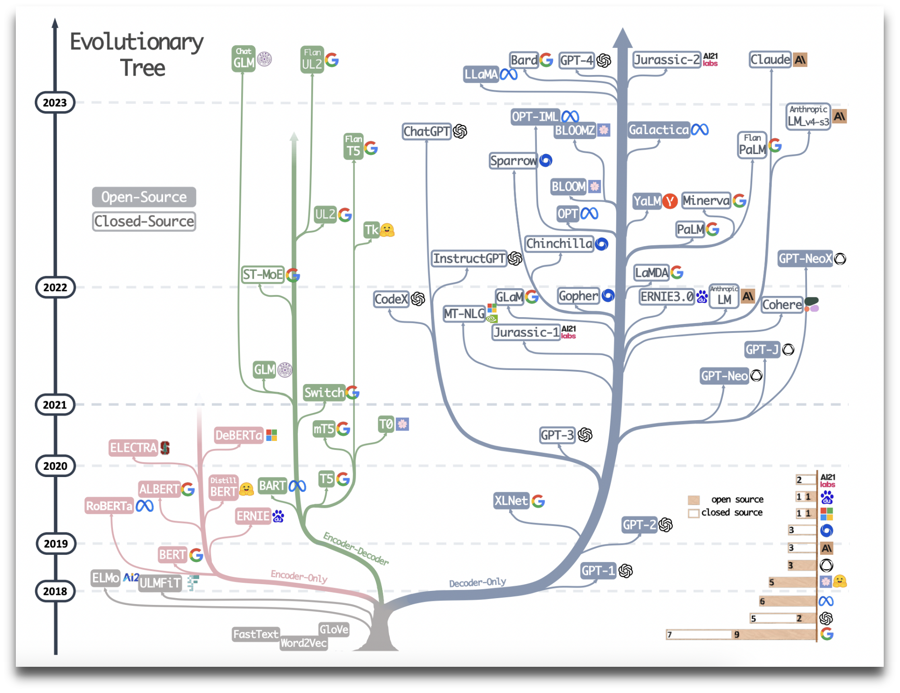

梳理下大语言模型的网络结构，及对应相关的任务。

| 架构           | 代表模型            | 任务                                                         |
| -------------- | ------------------- | ------------------------------------------------------------ |
| Encoder models | BERT ALBERT RoBERTa | 句子分类、命名实体识别、提取式问答(extractive question answering) |
| Decoder models |                     GPT| 文本生成任务                                                   |
| Encoder-decoder models | BART T5| 总结、翻译或生成性问答 |

