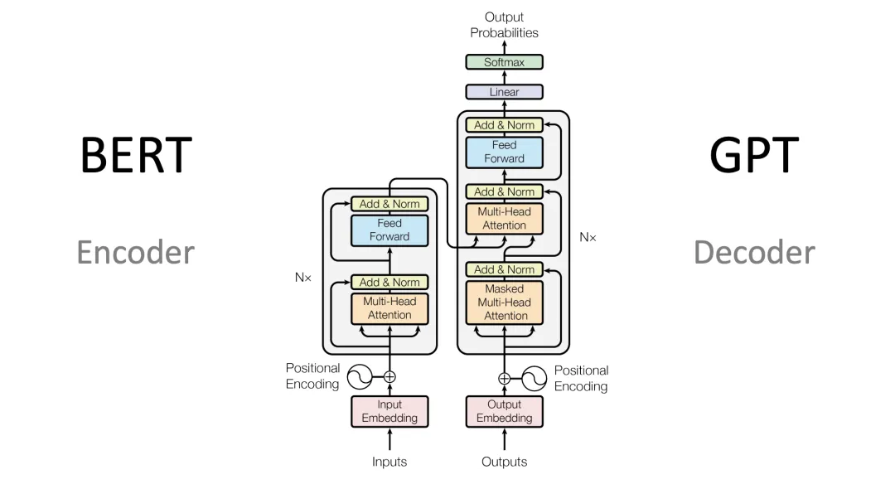

## Transformer

### 点积（Dot Product）

给定两个向量$\mathbf{x},\mathbf{y}\in\mathbb{R}^d$，
它们的*点积*（dot product）$\mathbf{x}^\top\mathbf{y}$
（或$\langle\mathbf{x},\mathbf{y}\rangle$）
是相同位置的按元素乘积的和：$\mathbf{x}^\top \mathbf{y} = \sum_{i=1}^{d} x_i y_i$。

### Encoder

目的: 对输入序列进行更好的向量表示

#### Embedding

用向量表示文字(词表+位置)

架构图上的Input Embedding也被成为Token Embedding

Embedding = Input Embedding(Token Embedding)  + Position Embedding

#### Positional Encoding

将文字的位置编码加上Input Embedding向量，得到新的向量表示。

正弦和余弦位置编码、ROPE等

RoPE（Rotary Positional Encoding）是一种创新的位置编码方法，旨在改进Transformer模型中位置信息的处理方式。与传统的绝对位置编码不同，RoPE通过旋转矩阵的方式将位置信息直接嵌入到词向量的计算过程中，特别是在自注意力机制中。

#### 自注意力机制

描述前文对下一个Token的影响。

$W^Q$,$W^K$,$W^V$是三个可训练的参数矩阵

$Q=XW^Q$

$K=XW^K$

$V=XW^V$

$ Attention(Q,K,V)=\mathrm{softmax}\left(\frac{\mathbf Q \mathbf K^\top }{\sqrt{d_k}}\right)V$

将上述的向量分别与其他向量做点积运算获得权重，然后将权重值再与对应的其他向量做乘法后相加，得到最后的向量表示。

多头注意力相当于把多个单头进行拼接后，做线性变换。

#### 残差结构

变换前的向量和变换后的向量相加,解决梯度消失问题。

#### 归一化线性变换

$FNN(X) = ReLu(Xw_1+b_1)w_2 + b_2$。

### Decoder

#### Masked Muti-Head Attention
一个Token只能与前面的Token计算相关性，而不能与其后面的词计算相关性。
(只能看过去,不能看未来)

#### 交叉自注意力机制

与自注意力不同,这里的$Q$来自Decoder当前部分的输出,而$K$,$V$来自整个Encoder的输出。

## 主流模型结构发展

梳理下大语言模型的网络结构，及对应相关的任务。

| 架构           | 代表模型            | 任务                                                         |
| -------------- | ------------------- | ------------------------------------------------------------ |
| Encoder models | BERT ALBERT RoBERTa | 句子分类、命名实体识别、提取式问答(extractive question answering) |
| Decoder models |                     GPT| 文本生成任务                                                   |
| Encoder-decoder models | BART T5| 总结、翻译或生成性问答 |

